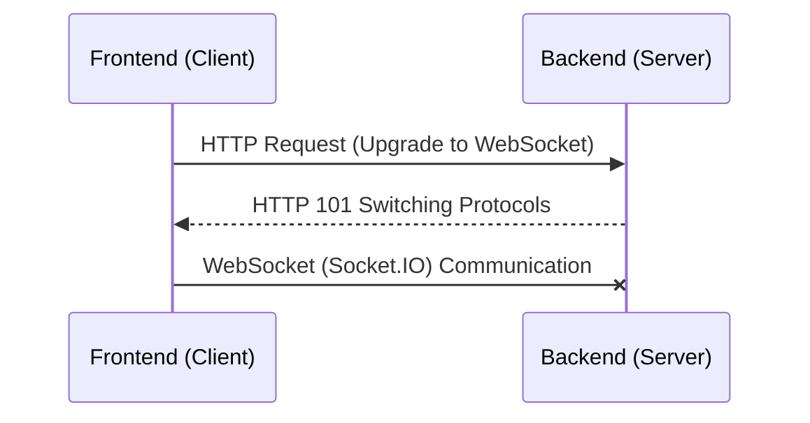

# Codexia

Codexia is a project designed to streamline and enhance your coding experience.

---

## 🚀 Features

- **✨ Intuitive interface** for developers
- **🧩 Modular & scalable architecture**
- **📚 Comprehensive documentation**

---

## 🏁 Getting Started

**1. Clone the repository**

```bash
git clone https://github.com/Codexia-IDT/Codexia.git
```

**2. Install dependencies**

```bash
npm install
cd ./Client && npm install
cd ../Server && npm install
cd ..
```

**3. Start the server and client (in separate terminals):**

| Server      | Client      |
| ----------- | ----------- |
| `cd Server` | `cd Client` |
| `npm start` | `npm start` |

---

## 🗂️ Project Folder Structure

```text
Codexia/
├── Client/                      # Frontend application (React + Vite)
│   ├── public/                  # Static assets (images, HTML)
│   ├── src/                     # React source code
│   │   ├── App.tsx              # Main App component
│   │   ├── main.tsx             # Entry point
│   │   ├── App.css, index.css   # Global styles
│   │   ├── components/          # Reusable UI components
│   │   │   └── LandingPage.tsx  # Landing page component
│   │   └── assets/              # Images and static assets
│   │       └── img/             # Image folders (avatars, features, hero-image.png)
│   ├── package.json             # Client dependencies & scripts
│   ├── vite.config.ts           # Vite configuration
│   └── ...                      # Other config files
├── Server/                      # Backend application (Node.js)
│   ├── public/                  # Static server assets
│   ├── src/                     # Server source code
│   │   ├── server.ts            # Main server entry point
│   │   └── types/               # Type definitions (e.g., User.ts)
│   ├── package.json             # Server dependencies & scripts
│   └── ...                      # Other config files
├── .gitignore                   # Git ignore rules
├── package.json                 # Root dependencies & scripts
├── README.md                    # Project overview
└── ...                          # Other root-level files
```

_This structure separates client and server, and organizes source code for clarity and scalability._

---

## 🗺️ Project Overview & Architecture

Codexia is split into two main parts:

- **Client**: A React-based frontend (in `Client/`) that communicates with the backend using WebSockets (Socket.IO).
- **Server**: A Node.js backend (in `Server/`) that manages real-time events and serves static files.

**Basic Architecture Diagram:**



---

## 📡 WebSocket Events Documentation

The backend communicates with the frontend using WebSocket events (Socket.IO). There are no REST endpoints.

### Connection

- The client connects to the server using Socket.IO.

#### Built-in Events

- `connect` — Fired when a client connects.
- `disconnect` — Fired when a client disconnects.

> _See `Server/src/server.ts` for the full list of events and their usage._

---

## ⚙️ Environment Setup

1. **Node.js** (v18+ recommended)
2. **.env files** (for environment variables)

**Client:**

- Usually does not require a .env file unless using custom environment variables.

**Server:**

- Create a `.env` file in `Server/` for backend configuration (e.g., database URL, secret keys).

**Example `.env` for Server:**

```env
# Example environment variables
PORT=3000
```

> _See the codebase or ask a maintainer for required variables._
